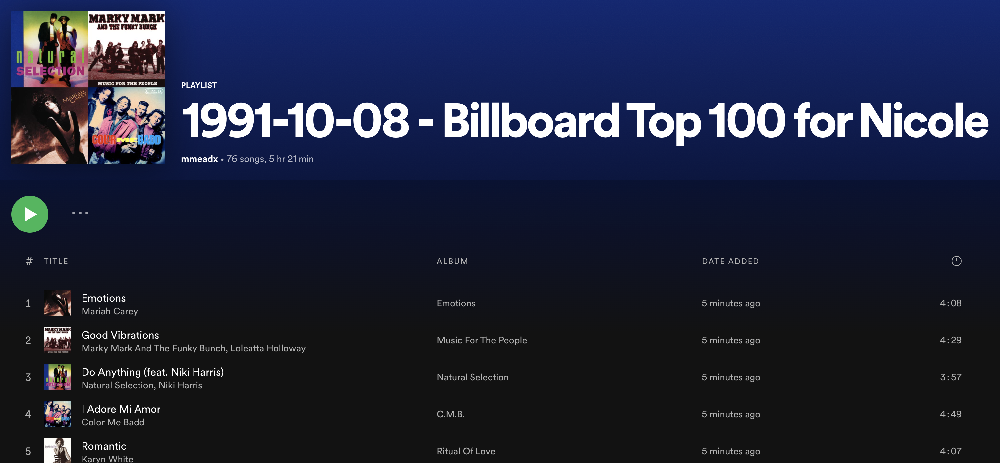

# Playlist Maker
_A Python program that scrapes Billboard's Top 100 for a specific date and adds those songs to a playlist in Spotify created while taking Angela Yu's '100 Days of Code' course on Udemy_

## In Use ##

When the program runs it will ask for the date you'd like to create the playlist from as well as who you are making the playlist for. For Example, this is putting in a date of October 8, 1991 and is making it for Nicole (_this is my sister and her birthday_).

As the program runs, it loads the Billboard's Hot 100 page for the specific date and scrapes the page for the song titles.

Once it's created a list of those found, it searches Spotify for the songs and creates a list of URIs to create the private plalist. From there, you are free to share and make public.

## Backend | How it works ##

*Imports*

_Documentation for imports_

[Requests](https://docs.python-requests.org/en/latest/)

[Beautiful Soup](https://www.crummy.com/software/BeautifulSoup/bs4/doc/)

[Spotipy](https://spotipy.readthedocs.io/en/2.19.0/)

### Code ###

The first thing to do is go through Authentication - making sure you grab the 'current_user' and save that into a variable -- you'll need that later.

Then gathering your information and creating Beautiful Soup - finding the song titles and using list comprehension to make a list of Top 100 Songs.

All that's left to do is connect to Spotify and search for the songs in your list - create a playlist - and then add those songs found to the playlist.

I put in some print statements in to show which songs weren't found in the console.

